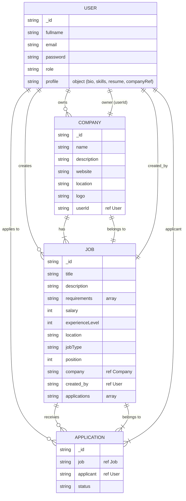

**High‑Level Summary**

The **JobHunt** repository implements a full‑stack **job‑portal** web application using the **MERN** (MongoDB‑Express‑React‑Node) stack, with **Vite** for the front‑end build system and **Tailwind CSS** for styling. The system provides:

* **Role‑based authentication** (student vs. recruiter) with JWT‑based session cookies.  
* **Google OAuth** login/signup.  
* **Resume upload** via **Cloudinary**.  
* **CRUD operations** for users, companies, jobs, and applications.  
* **Admin dashboard** for recruiters to post and manage jobs.  
* **Redux‑Persist** for client‑side state persistence.  
* **RESTful API** protected by an `isAuthenticated` middleware.  
* **Frontend UI** built with **React**, **Vite**, **Tailwind**, **Radix UI** components, and **Radix UI‑styled** UI primitives (buttons, inputs, badges, etc.).  
* **Redux Toolkit** slices for `auth`, `job`, `company`, and `application` data.  
* **Axios** for client‑side API calls.  
* **Server‑side utilities**: Cloudinary helper, data‑uri conversion for file uploads, a Google OAuth client, and a DB connection helper.

The project is organized into two top‑level folders: `backend` and `frontend`, with a root `package.json` that runs the backend and triggers a front‑end build.

---

## High‑Level Design (HLD)

### 1. System Architecture

```
┌───────────────────┐      ┌───────────────────────┐
│   Front‑End      │<----►│   REST API (Express) │
│   (React/Vite)  │      │   (Node.js)         │
└───────┬───────────┘      └───────┬───────┬──────┘
        │                         │
        ▼                         ▼
  Browser (SPA)            MongoDB (Data store)
```

* **Client (React)** – SPA that renders UI components, uses **React Router** for navigation, and **Redux** for state management.  
* **API Server (Express)** – Handles HTTP requests, performs authentication/authorization, and interacts with MongoDB.  
* **MongoDB** – Stores `users`, `companies`, `jobs`, `applications`.  
* **Cloudinary** – Stores uploaded files (e.g., resumes, company logos).  

### 2. Key External Services

| Service   | Purpose | Integration |
|----------|---------|------------|
| **MongoDB Atlas** | Persistent data store | `mongoose` models |
| **Cloudinary** | Media (logo, resume) storage | `cloudinary` SDK |
| **Google OAuth** | Social login | `googleapis` + `@react-oauth/google` |

### 3. Deployment & Runtime

* **Backend**: Node.js (`node` + `nodemon`) → hosted (e.g., Render).  
* **Frontend**: Vite‑built static assets served by the backend or a static host (Vite `dist`).  
* **Environment**: `.env` holds `MONGO_URI`, `CLOUD_NAME`, `API_KEY`, `API_SECRET`, `SECRET_KEY`, and Google OAuth credentials.

---

## Low‑Level Design (LLD)

### 1. Backend Layout (`/backend`)

```
backend/
│
├─ index.js               // Express app, DB connection, middlewares, routes
├─ utils/
│   ├─ cloudinary.js    // Cloudinary config
│   ├─ db.js            // Mongoose connect
│   ├─ datauri.js      // Convert multipart to data‑uri
│   └─ googleClient.js // OAuth2 client
├─ middlewares/
│   ├─ isAuthenticated.js // JWT verification, sets req.id
│   └─ mutler.js          // Multer memory storage for file uploads
├─ models/
│   ├─ user.model.js
│   ├─ company.model.js
│   ├─ job.model.js
│   └─ application.model.js
├─ controllers/
│   ├─ user.controller.js
│   ├─ company.controller.js
│   ├─ job.controller.js
│   └─ application.controller.js
└─ routes/
    ├─ user.route.js
    ├─ company.route.js
    ├─ job.route.js
    └─ application.route.js
```

#### 1.1 Data Model (MongoDB)

| Model | Key Fields | Relations |
|------|-----------|----------|
| **User** | `fullname`, `email`, `password`, `role`, `profile` (bio, skills, resume, company ref) | `User` can own a `Company` (recruiter) |
| **Company** | `name`, `description`, `website`, `location`, `logo`, `userId` (owner) | 1‑to‑1 with `User` (owner) |
| **Job** | `title`, `description`, `requirements`, `salary`, `experienceLevel`, `location`, `jobType`, `position`, `company` (ref), `created_by` (User), `applications` (array of Application) | Many‑to‑One `Company` + `User` |
| **Application** | `job` (ref), `applicant` (User), `status` | Many‑to‑One `Job`, `User` (applicant) |

#### 1.2 Controllers (Business Logic)

* **User** – register (multipart upload for resume), login (JWT cookie), logout, Google OAuth, profile update (upload new resume/photo).  
* **Company** – `registerCompany`, `getCompany` (for logged‑in recruiter), `updateCompany` (logo upload).  
* **Job** – `postJob`, `getAllJobs` (keyword filter), `getAdminJobs` (admin view), `getJobById`.  
* **Application** – `applyJob`, `getAppliedJobs` (user), `getApplicants` (recruiter view), `updateStatus`.

All routes use `isAuthenticated` where needed; file uploads use `singleUpload`.

### 2. Front‑End Layout (`/frontend`)

```
src/
│
├─ components/                 // UI & pages
│   ├─ admin/                 // Admin dashboard (jobs, companies, applicants)
│   ├─ auth/                  // Login / Signup
│   ├─ shared/               // Navbar, Footer
│   └─ ui/                   // Radix UI components (avatar, badge, button, input, etc.)
├─ hooks/                    // Data‑fetching hooks (Axios)
│   ├─ useGetAllJobs.jsx
│   ├─ useGetAllAdminJobs.jsx
│   ├─ useGetAllCompanies.jsx
│   ├─ useGetCompanyById.jsx
│   ├─ useGetAppliedJobs.jsx
│   └─ …
├─ redux/                     // Redux slices
│   ├─ authSlice.js
│   ├─ jobSlice.js
│   ├─ companySlice.js
│   └─ applicationSlice.js
│   └─ store.js (redux‑persist)
├─ utils/                    // Tailwind + classnames helper
├─ App.jsx, main.jsx        // App entry, router
└─ index.css                // Tailwind import
```

#### 2.1 UI Flow

1. **App** → **React Router** renders pages (Home, Browse, JobDescription, Admin routes).  
2. **Pages** import **hooks** to fetch data via `axios` (`withCredentials: true` to send JWT cookie).  
3. **Hooks** dispatch Redux actions (`setAllJobs`, `setAllAdminJobs`, etc.) into the store.  
4. **Components** read state via `useSelector`, display data, and handle UI interactions (search, filters).  
5. **Admin Pages** are wrapped by `ProtectedRoute` to ensure only `recruiter` role accesses them.  
6. **File Uploads** (profile photo, resume, company logo) → `singleUpload` middleware → `cloudinary` utility → Cloudinary URL stored in DB.

#### 2.2 State Management

* **Auth** – `user` and `loading` flags.  
* **Job** – `allJobs`, `allAdminJobs`, `searchJobByText`, `searchedQuery`, `singleJob`, `allAppliedJobs`.  
* **Company** – `companies`, `singleCompany`, `searchCompanyByText`.  
* **Application** – `applicants` (for a job).  
* **Persistence** – `redux-persist` stores state in `localStorage` (`auth`, `job`, `company`, `application`).

### 3. API Endpoints (REST)

| Entity | Method | Path | Description |
|--------|-------|------|-------------|
| **User** | `POST /api/v1/user/register` | Register (multipart for resume) |
| | `POST /api/v1/user/login` | JWT login |
| | `GET /api/v1/user/logout` | Clear cookie |
| | `POST /api/v1/user/google` | Google OAuth |
| | `POST /api/v1/user/profile/update` | Update profile (photo upload) |
| **Company** | `POST /api/v1/company/register` (auth) |
| | `GET /api/v1/company/get` | Get recruiter’s company |
| | `GET /api/v1/company/get/:id` | Public company data |
| | `PUT /api/v1/company/update/:id` (auth + upload) |
| **Job** | `POST /api/v1/job/post` (auth) | Create job |
| | `GET /api/v1/job/get` (with query param `keyword`) | Search / list |
| | `GET /api/v1/job/getadminjobs` (auth) | Admin view |
| | `GET /api/v1/job/get/:id` | Job details |
| **Application** | `GET /api/v1/application/apply/:id` (auth) | Apply to job |
| | `GET /api/v1/application/get` (auth) | List applicant’s jobs |
| | `GET /api/v1/application/:id/applicants` (auth) | List applicants for a job |
| | `POST /api/v1/application/status/:id/update` (auth) | Update status (accept/reject) |

All protected routes use `isAuthenticated` (JWT from cookie) and expose data in `{ success, ... }` JSON responses.

### 4. Security & Middleware

* **JWT** stored in an http‑only cookie (`req.cookies.token`).  
* `isAuthenticated` verifies token, attaches `req.id` for further DB queries.  
* **CORS** configured in `backend/index.js` (not shown but typical).  
* **Password** hashed with `bcryptjs`.  
* **Upload** size limited by Multer memory storage; file is converted to Data URI for Cloudinary upload.  
* **Environment** variables are not committed (`.gitignore` excludes `.env`).

### 5. Build & Deploy

* **Development**: `npm run dev` – runs `nodemon backend/index.js` with Vite dev server.  
* **Production build**: `npm run build` – installs front‑end deps, builds Vite assets, then runs `node backend/index.js`.  
* **Static assets** (React bundle) served by Express `static` middleware (in `backend/index.js`, not shown) from `frontend/dist`.  
* **CI/CD** may be configured to push to Render/Heroku with environment variables.

---
# Project Schema Design (MongoDB)

## Entity Overview

| Entity | Collection | Key Fields | Relationships |
|--------|----------|------------|--------------|
| **User** | `users` | `fullname`, `email`, `password`, `role` (`student` / `recruiter`), `profile` (object) | - **One‑to‑One** `profile.company` → **Company** (`userId` is required in **Company**) <br> - **One‑to‑Many** `User` (as *recruiter*) **creates** `Job` (`created_by`) <br> - **One‑to‑Many** `User` (as *applicant*) **creates** `Application` (`applicant`) |
| **Company** | `companies` | `name`, `description`, `website`, `location`, `logo`, `userId` (ref **User**) | - **One‑to‑One** `userId` → **User** (owner) <br> - **One‑to‑Many** `Company` → **Job** (`company`) |
| **Job** | `jobs` | `title`, `description`, `requirements`, `salary`, `experienceLevel`, `location`, `jobType`, `position`, `company` (ref **Company**), `created_by` (ref **User**), `applications` (array of **Application** IDs) | - **Many‑to‑One** `company` → **Company** <br> - **Many‑to‑One** `created_by` → **User** (recruiter) <br> - **One‑to‑Many** `Job` → **Application** (`applications` array) |
| **Application** | `applications` | `job` (ref **Job**), `applicant` (ref **User**), `status` (`pending`/`accepted`/`rejected`) | - **Many‑to‑One** `job` → **Job** <br> - **Many‑to‑One` `applicant` → **User** (student) |

---

## Relationship Diagram (Mermaid ER)



## Relationship Types Summary

| Relationship | Type |
|------------|------|
| User ↔ Company | **One‑to‑One** (User `userId` in Company) |
| Company ↔ Job | **One‑to‑Many** (Company can have many Jobs) |
| User ↔ Job (creator) | **One‑to‑Many** (Recruiter creates many Jobs) |
| Job ↔ Application | **One‑to‑Many** (Job can have many Applications) |
| User ↔ Application (applicant) | **One‑to‑Many** (Student can apply to many Jobs) |
| User ↔ Company (profile) | **One‑to‑One** (profile references Company) |

--- 

**Notes**

- All references use **ObjectId** references as defined in the Mongoose schemas.
- The `applications` array in **Job** is a convenience field; actual relationship is stored in **Application** documents.
- `profile` in **User** includes a `company` reference, allowing a recruiter to view their company details.


### Summary

- **Backend**: Express API with JWT auth, Google OAuth, Cloudinary integration, CRUD for jobs/companies/applications.  
- **Frontend**: React SPA with Tailwind, Radix UI components, Redux Toolkit state, Axios data fetching, protected admin routes.  
- **Database**: MongoDB models with relations for users, companies, jobs, and applications.  
- **Overall**: A cleanly‑structured MERN stack application ready for deployment, with clear separation of concerns, reusable UI components, and a responsive UI.
